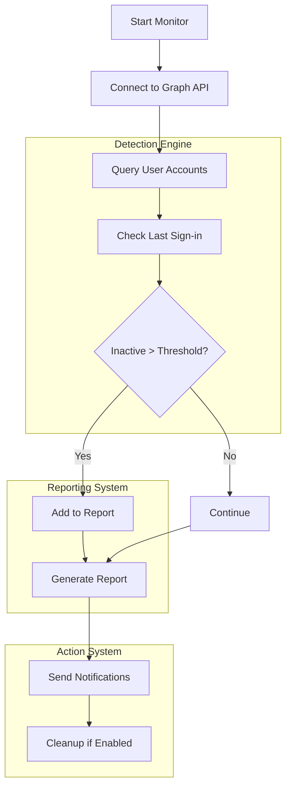

# Account Inactivity Monitor

<div align="center">


[](https://github.com/PowerShell/PowerShell)
[](https://docs.microsoft.com/en-us/graph/)
[](https://docs.microsoft.com/en-us/azure/active-directory/)
[](https://github.com/jaquanwatson/account-inactivity-monitor)
[](LICENSE)

</div>

## 🛡️ Overview

Account Inactivity Monitor is a security-focused solution that automatically detects and manages inactive user accounts across Active Directory and Microsoft 365 environments. By identifying and addressing dormant accounts, organizations can enhance their security posture, maintain compliance requirements, and optimize licensing costs.

### 🌟 Key Benefits

- **Enhance Security Posture**: Reduce attack surface by removing stale accounts
- **Reduce Licensing Costs**: Save $10K+ annually by reclaiming unused licenses
- **Maintain Compliance**: Support regulatory requirements for account management
- **Automate Routine Tasks**: Free up IT staff for higher-value activities
- **Comprehensive Visibility**: Gain insights across hybrid environments

## ✨ Features

<table>
  <tr>
    <td width="50%">
      <h3>🔍 Automated Detection</h3>
      <ul>
        <li>Cross-platform account discovery (AD & M365)</li>
        <li>Customizable inactivity thresholds</li>
        <li>Smart detection algorithms</li>
        <li>Service account exclusions</li>
      </ul>
    </td>
    <td width="50%">
      <h3>📊 Detailed Reporting</h3>
      <ul>
        <li>Comprehensive inactivity reports</li>
        <li>Cost savings calculations</li>
        <li>Security risk assessments</li>
        <li>Trend analysis over time</li>
      </ul>
    </td>
  </tr>
  <tr>
    <td>
      <h3>💰 Cost Optimization</h3>
      <ul>
        <li>License reclamation recommendations</li>
        <li>Automated license reassignment</li>
        <li>ROI tracking and reporting</li>
        <li>Budget impact analysis</li>
      </ul>
    </td>
    <td>
      <h3>🔒 Security Compliance</h3>
      <ul>
        <li>Zero-trust principle enforcement</li>
        <li>Compliance audit trails</li>
        <li>Approval workflows for actions</li>
        <li>Secure operation modes</li>
      </ul>
    </td>
  </tr>
</table>

## 🖼️ Screenshots & Demo

<div align="center">

### Inactivity Dashboard


### Cost Savings Report


</div>

## 🛠️ Technical Architecture



## 📋 Prerequisites

- PowerShell 5.1 or later
- Microsoft Graph PowerShell SDK
- Azure AD PowerShell Module
- Appropriate permissions:
  - `User.Read.All`
  - `AuditLog.Read.All`
  - `Directory.Read.All`

## 🚀 Installation & Setup

```powershell
# Clone the repository
git clone https://github.com/jaquanwatson/account-inactivity-monitor.git
cd account-inactivity-monitor

# Install dependencies
Install-Module Microsoft.Graph -Force
Install-Module AzureAD -Force

# Configure settings
Copy-Item config.example.json config.json
# Edit config.json with your settings

# Run the monitor
.\Start-InactivityMonitor.ps1 -DryRun
```

## ⚙️ Configuration

Create a `config.json` file:

```json
{
  "InactivityThresholdDays": 90,
  "ReportPath": "./reports/",
  "EmailNotifications": true,
  "AutoCleanup": false,
  "ExcludedGroups": ["Executives", "Service Accounts"],
  "NotificationEmail": "admin@company.com",
  "CostSettings": {
    "E3LicenseCost": 22,
    "E5LicenseCost": 35,
    "CurrencySymbol": "$"
  },
  "SecuritySettings": {
    "RequireApproval": true,
    "LogAllActions": true,
    "NotifyUserBeforeAction": true,
    "ActionDelayDays": 7
  }
}
```

## 📊 Sample Output

```
Account Inactivity Report - 2025-01-08
==========================================
Total Accounts Scanned: 1,247
Inactive Accounts Found: 23
Potential Monthly Savings: $345

Inactive Accounts:
- john.doe@company.com (Last login: 2024-09-15)
- jane.smith@company.com (Last login: 2024-08-22)
- old.account@company.com (Last login: 2024-07-10)

Security Risk Assessment:
- High Risk: 5 accounts (former employees)
- Medium Risk: 12 accounts (unused service accounts)
- Low Risk: 6 accounts (seasonal employees)

Recommended Actions:
- Disable: 17 accounts
- Delete: 3 accounts
- Monitor: 3 accounts
```

## 🔒 Security Considerations

- **Least Privilege**: Uses minimal required permissions
- **Dry Run Mode**: Test without making changes
- **Audit Logging**: Comprehensive action tracking
- **Approval Workflow**: Requires explicit approval for critical actions
- **Service Account Protection**: Automatic exclusion of critical accounts

## 🧩 Advanced Features

### Custom Action Workflows

```powershell
# Define custom action for executive accounts
$executiveWorkflow = @{
    NotificationTemplate = "Executive-Notice.html"
    ApprovalRequired = $true
    ApproverEmail = "ciso@company.com"
    GracePeriod = 30  # days
    EscalationPath = @("manager", "director", "ciso")
}
```

### Integration Options

- **SIEM Systems**: Export data to security monitoring platforms
- **ServiceNow**: Create tickets for account actions
- **Power BI**: Advanced reporting and dashboards
- **Microsoft Teams**: Action notifications and approvals

## 🤝 Contributing

We welcome contributions! Please follow these steps:

1. Fork the repository
2. Create a feature branch (`git checkout -b feature/improvement`)
3. Commit your changes (`git commit -am 'Add new feature'`)
4. Push to the branch (`git push origin feature/improvement`)
5. Create a Pull Request

## 📄 License

This project is licensed under the MIT License - see the [LICENSE](LICENSE) file for details.

## 👤 Author & Support

**Jaquan Watson** - Cloud & Systems Engineer

- Email: jqwatson96@gmail.com
- LinkedIn: [jaquanwatson](https://linkedin.com/in/jaquanwatson)
- GitHub: [@jaquanwatson](https://github.com/jaquanwatson)

### Implementation Case Study

> "Implementing the Account Inactivity Monitor helped us identify over 200 dormant accounts, resulting in annual savings of approximately $42,000 in license costs while significantly improving our security posture." - Enterprise IT Director

---

<div align="center">

⭐ **If this project helped you, please give it a star!** ⭐

Built with ❤️ for better IT security

</div>